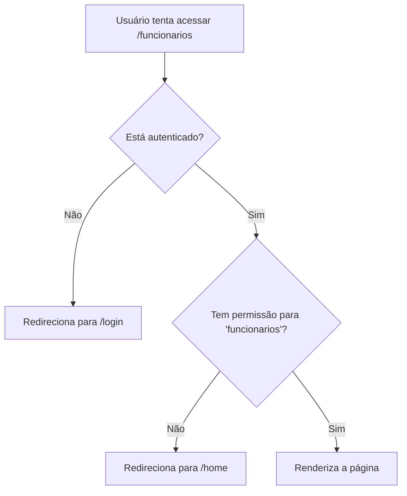

# 🔐 Sistema de Permissões

## 📋 Visão Geral

O sistema implementa controle de acesso baseado em **perfis de usuário**, onde cada perfil tem permissões específicas para acessar rotas.

---

## 🎯 Perfis e Permissões

### Hierarquia de Permissões

| Perfil            | Produtos | Movimentações | Fornecedores | Funcionários | Dashboard |
| ----------------- | -------- | ------------- | ------------ | ------------ | --------- |
| **Administrador** | ✅       | ✅            | ✅           | ✅           | ✅        |
| **Gerente**       | ✅       | ✅            | ✅           | ❌           | ✅        |
| **Estoquista**    | ✅       | ✅            | ❌           | ❌           | ✅        |

---

## 🛠️ Implementação

### 1. Arquivo de Configuração (`/lib/permissions.ts`)

```typescript
export const PERMISSIONS_BY_ROLE = {
  administrador: [
    "produtos",
    "movimentacoes",
    "fornecedores",
    "funcionarios",
    "dashboard",
  ],
  gerente: ["produtos", "movimentacoes", "fornecedores", "dashboard"],
  estoquista: ["produtos", "movimentacoes", "dashboard"],
} as const;
```

### 2. Funções Disponíveis

#### `hasPermission(role, route)`

Verifica se um perfil tem permissão para uma rota específica.

```typescript
import { hasPermission } from "@/lib/permissions";

const canAccessFuncionarios = hasPermission(userRole, "funcionarios");
// administrador: true
// gerente: false
// estoquista: false
```

#### `getAllowedRoutes(role)`

Retorna todas as rotas permitidas para um perfil.

```typescript
import { getAllowedRoutes } from "@/lib/permissions";

const routes = getAllowedRoutes("gerente");
// ["produtos", "movimentacoes", "fornecedores", "dashboard"]
```

#### `isAdmin(role)`

Verifica se é administrador.

```typescript
import { isAdmin } from "@/lib/permissions";

isAdmin("administrador"); // true
isAdmin("gerente"); // false
```

#### `isManagerOrAbove(role)`

Verifica se é gerente ou administrador.

```typescript
import { isManagerOrAbove } from "@/lib/permissions";

isManagerOrAbove("administrador"); // true
isManagerOrAbove("gerente"); // true
isManagerOrAbove("estoquista"); // false
```

---

## 🧩 Componentes

### Navigation (Header)

O header automaticamente filtra os links baseado no perfil do usuário logado.

```tsx
// /components/layout/header/navigation.tsx
// Já implementado - funciona automaticamente
```

**Comportamento:**

- **Administrador**: Vê todos os links (Produtos, Movimentações, Fornecedores, Funcionários)
- **Gerente**: Vê Produtos, Movimentações, Fornecedores
- **Estoquista**: Vê apenas Produtos e Movimentações

---

### ProtectedRoute

Componente para proteger páginas inteiras.

```tsx
import { ProtectedRoute } from "@/components/ProtectedRoute";

export default function FuncionariosPage() {
  return (
    <ProtectedRoute requiredRoute="funcionarios">
      {/* Conteúdo da página */}
    </ProtectedRoute>
  );
}
```

**Características:**

- ✅ Redireciona para `/login` se não estiver autenticado
- ✅ Redireciona para `/home` se não tiver permissão
- ✅ Mostra loading durante verificação
- ✅ Previne renderização de conteúdo não autorizado

**Parâmetros:**

- `requiredRoute`: Rota necessária ("produtos" | "movimentacoes" | "fornecedores" | "funcionarios" | "dashboard")
- `fallbackUrl`: URL de redirecionamento (padrão: "/home")

---

## 📝 Exemplos de Uso

### Proteger uma Página

```tsx
// /app/(auth)/funcionarios/page.tsx
"use client";
import { ProtectedRoute } from "@/components/ProtectedRoute";

export default function FuncionariosPage() {
  return (
    <ProtectedRoute requiredRoute="funcionarios">
      <div>
        <Header />
        <main>{/* Apenas administradores verão isso */}</main>
        <Footer />
      </div>
    </ProtectedRoute>
  );
}
```

### Renderização Condicional

```tsx
"use client";
import { useSession } from "next-auth/react";
import { hasPermission, isAdmin } from "@/lib/permissions";

export function MeuComponente() {
  const { data: session } = useSession();
  const userRole = session?.user?.perfil;

  return (
    <div>
      {/* Mostrar apenas para quem pode acessar funcionários */}
      {hasPermission(userRole, "funcionarios") && (
        <button>Gerenciar Funcionários</button>
      )}

      {/* Mostrar apenas para administradores */}
      {isAdmin(userRole) && <button>Configurações Avançadas</button>}

      {/* Mostrar para gerente ou superior */}
      {isManagerOrAbove(userRole) && <button>Relatórios</button>}
    </div>
  );
}
```

### Verificar Permissão em uma Ação

```tsx
import { hasPermission } from "@/lib/permissions";
import { useSession } from "next-auth/react";
import { toast } from "sonner";

export function DeleteButton() {
  const { data: session } = useSession();

  const handleDelete = () => {
    if (!hasPermission(session?.user?.perfil, "funcionarios")) {
      toast.error("Você não tem permissão para deletar funcionários");
      return;
    }

    // Proceder com deleção
  };

  return <button onClick={handleDelete}>Deletar</button>;
}
```

---

## 🔄 Fluxo de Autenticação e Autorização



---

## ⚙️ Adicionar Nova Rota/Permissão

### 1. Atualizar o tipo e constante

```typescript
// /lib/permissions.ts
export type RouteKey = "produtos" | "movimentacoes" | "fornecedores" | "funcionarios" | "dashboard" | "nova_rota";

export const PERMISSIONS_BY_ROLE = {
  administrador: [..., "nova_rota"],
  gerente: [..., "nova_rota"],
  estoquista: [...], // sem acesso
};
```

### 2. Adicionar no header (se necessário)

```typescript
// /components/layout/header/navigation.tsx
const allItems: Array<{ label: string; href: string; key: RouteKey }> = [
  // ... existentes
  { label: "Nova Seção", href: "/nova-secao", key: "nova_rota" },
];
```

### 3. Proteger a página

```tsx
// /app/(auth)/nova-secao/page.tsx
export default function NovaSecaoPage() {
  return (
    <ProtectedRoute requiredRoute="nova_rota">{/* Conteúdo */}</ProtectedRoute>
  );
}
```

---

## 🐛 Troubleshooting

### Usuário vê links mas não acessa a página

**Causa**: Header não está sincronizado com ProtectedRoute  
**Solução**: Verifique se o `key` no navigation.tsx corresponde ao `requiredRoute`

### Redirecionamento em loop

**Causa**: `fallbackUrl` também requer permissão  
**Solução**: Use uma rota acessível para todos (ex: "/home" ou "/dashboard")

### Permissões não atualizam

**Causa**: Sessão em cache  
**Solução**: Faça logout e login novamente, ou force refresh do token

---

## ✅ Checklist de Implementação

Para adicionar controle de permissões a uma nova página:

- [ ] Definir qual perfil pode acessar
- [ ] Adicionar rota em `PERMISSIONS_BY_ROLE` se necessário
- [ ] Adicionar item no header navigation (se aplicável)
- [ ] Envolver página com `<ProtectedRoute>`
- [ ] Testar com diferentes perfis de usuário

---

## 🔒 Segurança

⚠️ **IMPORTANTE**: Este sistema de permissões funciona apenas no **frontend**. O backend DEVE validar permissões independentemente:

```typescript
// Backend (Node.js/Express exemplo)
app.delete("/usuarios/:id", authMiddleware, (req, res) => {
  if (req.user.perfil !== "administrador") {
    return res.status(403).json({ message: "Sem permissão" });
  }
  // Proceder com deleção
});
```

**Nunca confie apenas em validações do frontend!**
